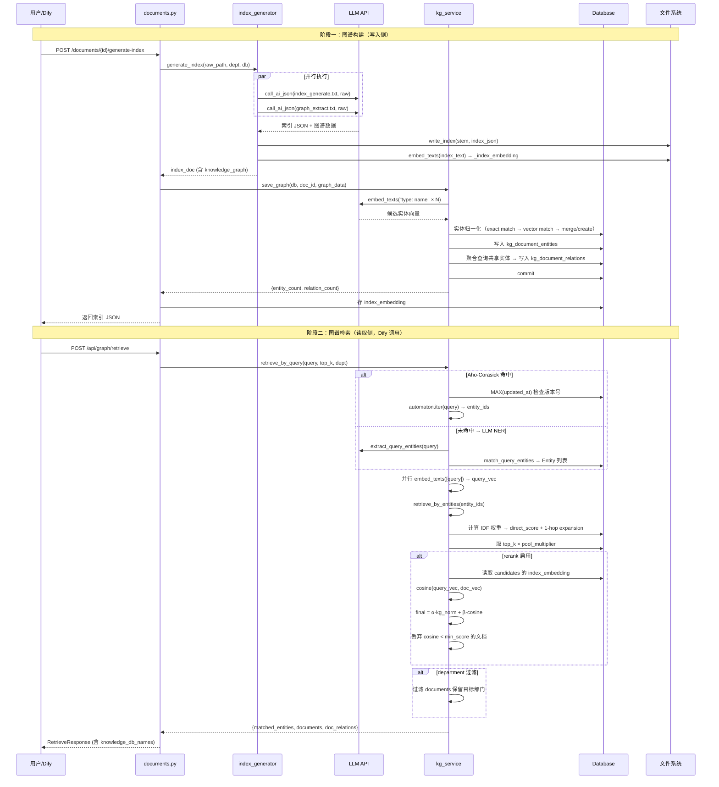

# 知识图谱全流程文档：从生成到调用读取

## 1. 总体概览

平台在每个文档完成**脱敏 → 索引生成**的流水线上，同步完成知识图谱的**实体抽取 → 实体归一化 → 文档-实体边构建 → 文档-文档关系构建**。图谱数据沉淀在 3 张数据库表 + 1 列向量上，检索阶段通过 `POST /api/graph/retrieve`（无鉴权，供 Dify 调用）返回经图召回 + 主题 rerank 排序的文档列表。

```
文档上传 → 脱敏 → 索引生成（并行）──┬── 索引 JSON → 写磁盘
                                     │
                                     ├── 知识图谱（实体+关系）→ DB
                                     │
                                     └── 主题向量 → documents.index_embedding

检索阶段（Dify 调用）──┬── Aho-Corasick 快速路径（< 5ms）
                        │
                        ├── LLM NER → 向量匹配（300-800ms）
                        │
                        ├── IDF 文档评分 + 1-hop 扩展
                        │
                        ├── 主题 embedding rerank（可选）
                        │
                        └── 返回 ranked docs → Dify 知识库 metadata 过滤
```

---

## 2. 数据模型

### 2.1 三层图结构

```
kg_entities                kg_document_entities           kg_document_relations
┌───────────┐              ┌──────────────────┐           ┌──────────────────────┐
│ id         │◄── FK ──── │ document_id      │           │ src_doc_id (FK)      │
│ name       │              │ entity_id (FK)   │           │ dst_doc_id (FK)      │
│ entity_type│              │ relation_type    │           │ relation_type        │
│ aliases    │              │ confidence       │           │ weight (共享实体数)  │
│ embedding  │              └──────────────────┘           │ shared_entities (JSON)│
│ embedding_dim│                                            └──────────────────────┘
│ mention_count│
│ updated_at   │
└───────────┘

documents 表额外列:
┌──────────────────────────────┐
│ index_embedding (BLOB/BYTEA) │  ← 文档 index 的"主题签名"向量
│ index_embedding_dim (INT)    │
└──────────────────────────────┘
```

### 2.2 各表/列作用

| 表/列 | 作用 |
|-------|------|
| `kg_entities` | 全局归一化的实体节点，7 种类型：`person` / `customer` / `project` / `product` / `org` / `contract` / `other`。带向量 embedding + aliases 别名列表 + mention_count 被提及次数。 |
| `kg_document_entities` | 边：Document → Entity。`relation_type` 取值：`mentions` / `about` / `authored_by` / `belongs_to`。 |
| `kg_document_relations` | 边：Document ↔ Document。无向边（存储时 `src_id < dst_id`），weight 为共享实体数，shared_entities 为具体的共享实体 ID 列表（JSON 格式）。 |
| `documents.index_embedding` | 文档 index 的"主题签名"向量（由 purpose + summary + keywords + scenarios 拼接后做 embedding），用于检索阶段做主题级 rerank。 |

### 2.3 实体命名与归一化

- 名称在入库前经过 `_normalize_name()` 做 `casefold()` 归一化（中英文统一大小写）。
- 黑名单机制：`settings.kg_entity_blacklist` 中配置的实体名（如"本公司"、"领导"）会被过滤，不参与实体注册或匹配。
- 同一实体的多种字面形式（如"A项目"、"A项目二期"）以 aliases 数组存储在 `Entity.aliases` 字段（JSON 格式）。

---

## 3. 图谱构建流程（写入侧）

### 3.1 触发时机

知识图谱构建在 `POST /api/documents/{id}/generate-index` 或 `POST /api/batch/run` 中自动触发，是索引生成流水线的一部分。

**调用链**：

```
documents.py::trigger_index
  └─► index_generator.generate_index()
        │
        ├── call_ai_json("index_generate.txt", raw_content)       ← 原版 index
        ├── call_ai_json("index_generate.txt", redacted_content)  ← 脱敏版 index
        └─► _safe_graph_extract(raw_content)                     ← 图抽取（并行）
              └─► call_ai_json("graph_extract.txt", content)
```

关键设计：
- 三者（原版索引、脱敏版索引、图抽取）通过 `asyncio.gather()` **并行**执行，互不阻塞。
- 图抽取使用 `graph_extract.txt` prompt，`temperature=0.1`，`max_tokens=4096`，`chunk_strategy="graph_merge"`。
- 图抽取失败时 `graceful degradation`：返回 `{"entities": [], "document_relations": []}`，不影响索引和 Dify 上传。

### 3.2 LLM 图抽取（graph_extract.txt）

LLM 接收整份文档全文，输出 JSON 结构：

```json
{
  "entities": [
    {
      "name": "张三",
      "type": "person",
      "aliases": ["小张", "张经理"]
    },
    ...
  ],
  "document_relations": [
    {
      "entity_name": "张三",
      "relation": "authored_by"
    },
    ...
  ]
}
```

### 3.3 实体归一化（kg_service.normalize_entities）

LLM 输出的是**原始实体候选**，需要经过归一化才能入库，避免同名实体因字面差异产生多份副本。

```
候选实体列表 ──┬── 清理：normalize_name + 黑名单过滤 + 类型校准（非法类型 → "other"）
               │
               ├── 快速路径：_exact_match_entity(db, type, name)
               │    └── 精确匹配（name 或 alias），命中则直接 merge
               │
               ├── 慢速路径：批量 embedding → 向量相似度匹配
               │    ├── embed_texts(["type: name", ...])  ← DashScope text-embedding-v4
               │    └── _find_similar_entity(db, type, vec, threshold=0.88)
               │         └── 同类型所有实体逐一计算 cosine，取最高分
               │
               └── 决策：
                    ├── 命中 exact match  → _merge_entity（追加 alias + 更新质心向量 + mention_count++）
                    ├── cosine ≥ 0.88    → _merge_entity
                    └── 都未命中         → _create_entity（新建行）
```

**核心算法细节**：

- `_merge_entity`：合并时将新名称追加到 aliases（去重），向量使用 `weighted_mean(old_vec, old_mention_count, new_vec)` 更新质心。
- 候选实体的 embedding 在**一次批量请求**中完成（减少 API 调用次数）。
- embedding 失败时自动降级为仅名称匹配（graceful degradation）。

### 3.4 写入文档-实体边（_write_document_entities）

```
输入：doc_id, entity_map (归一化后的 [(entity_id, candidate), ...]), document_relations
  │
  ├── name → entity_id 映射表（含 aliases）
  ├── 解析 document_relations，提取 {entity_id: relation_type}
  ├── 查询该文档已有的 (entity_id, relation_type) 三元组
  ├── UPSERT 策略（不删除旧数据）：
  │    └── 新三元组不存在则 INSERT（依赖 uq_doc_entity_rel 唯一约束去重）
  │
  └── 返回：该文档当前链接的所有 entity_id 集合（旧 + 新）
```

**重要设计**：采用 UNION 策略而非 DELETE-INSERT，保护图谱免受 LLM 临时性欠提取影响（如果某次抽取漏了某个实体，旧的边不会被删除）。

### 3.5 构建文档-文档关系边（_build_relations_for_document）

```
输入：doc_id, entity_ids（该文档链接的所有实体 ID）
  │
  ├── 删除该文档的所有旧边（src_id 或 dst_id 涉及 doc_id）
  │
  ├── 单条聚合 SQL 查询共享实体 ≥ kg_min_shared_entities 的其他文档：
  │      SELECT document_id, COUNT(*) AS shared_count
  │      FROM kg_document_entities
  │      WHERE entity_id IN (?, ?, ...) AND document_id != doc_id
  │      GROUP BY document_id HAVING COUNT(*) >= 2
  │      ORDER BY shared_count DESC LIMIT 50
  │
  ├── 对每个目标文档：
  │    ├── 查出具体共享的 entity_id 列表
  │    ├── _dominant_relation_type() → 按共享实体最多的类型决定关系标签
  │    │     project → same_project, customer → same_customer, ...
  │    ├── 保证 src < dst（无向边规范化）
  │    └── INSERT INTO kg_document_relations
  │
  └── 返回：写入的边数
```

### 3.6 save_graph() 总入口

```python
async def save_graph(db, doc_id, graph_data):
    entity_map = await normalize_entities(db, entities)          # 步骤 3.3
    linked_entity_ids = _write_document_entities(...)             # 步骤 3.4
    edges_written = _build_relations_for_document(...)            # 步骤 3.5
    db.commit()
    return {"entity_count": len(linked_entity_ids), "relation_count": edges_written}
```

在 `documents.py` 的 `trigger_index` 路由中，`generate_index` 返回后，若 `index_doc["knowledge_graph"]` 存在，则自动调用：

```python
from app.services.kg_service import save_graph
await save_graph(db, doc.id, graph_block)
```

### 3.7 主题向量写入

在索引生成的最后一步，`index_generator.py` 计算并返回 `_index_embedding`：

```python
rerank_text = build_index_rerank_text(full_index)
# "用途: 项目周报\n摘要: ...\n关键词: A项目, 里程碑\n场景: 进度汇报"
index_doc["_index_embedding"] = await embed_texts([rerank_text])
```

调用方（`documents.py`）将其持久化到 `Document` 行：

```python
doc.index_embedding = pack_vector(rerank_vec)
doc.index_embedding_dim = len(rerank_vec)
```

---

## 4. 图谱检索流程（读取侧）

### 4.1 入口：POST /api/graph/retrieve

该接口**不设鉴权**，专供 Dify HTTP 节点调用。

```bash
curl -X POST http://<host>:8000/api/graph/retrieve \
  -H "Content-Type: application/json" \
  -d '{"query": "A项目最近进展如何？", "top_k": 10, "department": null}'
```

### 4.2 完整检索管线（retrieve_by_query）

```
用户 query ──┬── Aho-Corasick 快速路径 ──────────────────────────┐
             │  (kg_query_use_automaton=True, < 5ms)              │
             │  如果命中 ≥ 1 → 跳过 LLM NER ─────────────────────┤
             │                                                     │
             │  命中 0 → 回退到 LLM NER 路径                       │
             │  ┌─ extract_query_entities()                       │
             │  │   call_ai_json("graph_query_extract.txt")       │
             │  │   model=qwen3.5-flash, temp=0.0, max_tokens=512  │
             │  └─► match_query_entities()                        │
             │       ┌─ exact match（同类型 name/alias）            │
             │       ├─ cross-type exact fallback                 │
             │       └─ vector similarity fallback                │
             │                                                     │
             ├── 查询 embedding（与 NER 并行）                     │
             │   embed_texts([query]) → query_vec                  │
             │                                                     │
             ├── retrieve_by_entities(db, entity_ids, top_k=N)    │
             │   ┌─ 计算每个实体的 IDF 权重 = 1 / log(1 + df)      │
             │   │   df = 提及该实体的不同文档数                    │
             │   ├─ direct_score(doc) = Σ IDF(matched_entities)   │
             │   ├─ 1-hop 扩展：通过 kg_document_relations 找邻居  │
             │   │   expansion_score = 0.5 × edge_weight          │
             │   │   最终 score = direct + expansion              │
             │   └─ 按 score 排序，取 top_k                        │
             │                                                     │
             ├── 主题 rerank（可选，kg_enable_index_rerank=True） │
             │   ┌─ 召回池扩展到 top_k × pool_multiplier          │
             │   ├─ 对每个候选 doc 计算 cosine(query_vec, doc.vec) │
             │   ├─ 丢弃 cosine < min_score 的文档                │
             │   └─ final = α × kg_norm + β × cosine             │
             │      α = kg_index_rerank_alpha (默认 0.6)          │
             │      β = kg_index_rerank_beta (默认 0.4)           │
             │                                                     │
             └── 可选 department 过滤                               │
                  └── documents = [d for d in docs if d.dept == X] │

                 ┌─────────────────────────────────────────────┐
                 │ 响应：                                      │
                 │ - matched_entities: 命中的实体列表            │
                 │ - documents: 排序后的文档列表（含 score）      │
                 │ - doc_relations: 文档间关系边                 │
                 │ - knowledge_db_names: 文档名列表（供 Dify）   │
                 └─────────────────────────────────────────────┘
```

### 4.3 Aho-Corasick 快速路径（kg_entity_matcher）

这是查询侧性能优化的关键模块。

**工作原理**：
1. 进程内维护一个 Aho-Corasick 多模式字符串匹配器（`ahocorasick.Automaton`）。
2. 每次匹配前检查 `SELECT MAX(updated_at) FROM kg_entities` 版本号，与缓存对比。版本号变了则**懒重建** automaton。
3. Automaton 注册了所有实体的 `normalize_name(name)` + 每个 alias 作为 surface form。
4. `extract_entity_ids(db, query)` 执行 automaton.iter(query)，收集所有命中，然后**最长匹配优先**消除重叠命中。
5. 如果命中 ≥ 1 个实体 ID，直接喂给 `retrieve_by_entities`，**跳过 LLM NER + embedding 匹配**。

**性能**：
- 20k 实体场景下，每进程 automaton 内存占用约几十 MB。
- 命中时延迟 < 5 ms（对比 LLM NER 的 300-800 ms）。

**配置**：
- `kg_query_use_automaton`（默认 `True`）：设为 `False` 可一键退回纯 LLM NER 路径。
- `kg_query_automaton_min_length`（默认 `2`）：过滤短 surface form，防止中文单字误匹配。

### 4.4 查询侧实体匹配（match_query_entities）

当 Aho-Corasick 未命中时，执行 LLM NER → 匹配管线：

```
LLM 输出 [{"name": "张三", "type": "person"}, ...]
  │
  ├── 清理 + 黑名单过滤 + 类型校准
  ├── 第一轮：_exact_match_entity(db, type, name)
  │    └── 精确匹配 name 或 alias（同类型）→ 命中则直接加入
  ├── 第二轮：_exact_match_entity_any_type(db, name)
  │    └── 跨类型精确匹配（LLM 类型分类经常出错时的兜底）
  │    └── 命中多个同名的实体时，按 mention_count DESC 选最热门的
  └── 第三轮：批量 embedding + _find_similar_entity()
       └── 向量相似度匹配（同类型，cosine ≥ 0.88）
```

### 4.5 文档评分（retrieve_by_entities）

**评分公式**：

```
direct_score(doc) = Σ weight(entity) for each entity matched in doc
                    where weight(entity) = 1 / log(1 + df(entity))
                    df = 提及该实体的不同文档数

expansion_score = Σ 0.5 × edge.weight for 1-hop neighbors

final_score = direct_score + expansion_score
```

IDF 权重确保稀有实体（如合同编号）的影响力超过高频实体（如"本公司"）。

### 4.6 主题 Rerank（二次筛选）

纯实体匹配只知道"哪些文档提到了这些实体"，无法区分"主题就是它"和"顺带提一句"。

**评分融合**：

```
kg_norm = kg_score / max_kg_score  （归一化到 [0, 1]）
cosine = cosine_similarity(query_vec, doc.index_embedding)

final = α × kg_norm + β × cosine
       (α = 0.6, β = 0.4)

if cosine < min_score (0.25) → 直接剔除
```

无 `index_embedding` 的文档（回填前）保留原始 KG 分数，系统**优雅降级**（graceful degradation）。

---

## 5. 后端管理 API（鉴权）

| 接口 | 方法 | 说明 | 权限 |
|------|------|------|------|
| `GET /api/graph/document/{doc_id}` | GET | 返回某文档的子图（实体节点 + 相关文档），供前端可视化 | 已登录 |
| `GET /api/graph/entities` | GET | 实体列表，支持 `q`（名称/别名模糊）、`entity_type` 过滤、分页 | 已登录 |
| `GET /api/graph/entities/{id}/documents` | GET | 列出引用某实体的全部文档 | 已登录 |
| `GET /api/graph/stats` | GET | 实体总数 / 文档-实体边数 / 文档-文档边数 + 按类型分布 | 已登录 |
| `POST /api/graph/rebuild` | POST | 对存量文档回填图数据（复用已有 index 缓存的 `knowledge_graph`，避免重复 LLM 调用） | 已登录 |
| `DELETE /api/graph/document/{doc_id}` | DELETE | 仅删除该文档的图边（DocumentEntity + DocumentRelation），实体节点保留 | 已登录 |
| `POST /api/graph/retrieve` | POST | **无鉴权**，供 Dify 调用 | 无 |

---

## 6. 前端可视化

前端通过 `KnowledgeGraphPage` 组件提供知识图谱管理页面：

- **实体列表**：表格展示全部实体，支持类型/名称过滤、分页。
- **实体详情**：点击查看某实体的详情面板，展示提及次数、别名列表、关联文档列表。
- **文档子图**：在文档列表页点击"查看知识图谱"按钮，弹出 Drawer 展示：
  - 根文档节点
  - 该文档提及的所有实体（带类型标签和颜色）
  - 通过共享实体关联的其他文档（带关系类型和共享实体数）

---

## 7. Dify 工作流接入

### 7.1 标准接入流程

```
Dify 聊天工作流:

[开始]
  │
  ├─► [HTTP 请求节点] POST /api/graph/retrieve
  │      body: {"query": "{{#sys.query#}}", "top_k": 10}
  │
  ├─► [变量提取器] 提取 $.knowledge_db_names → kb_names (Array<String>)
  │
  ├─► [条件分支]
  │      ├─ if length(kb_names) > 0
  │      │      └─► [知识检索节点] metadata 过滤:
  │      │             field = "knowlege_db_name"  ← 注意历史拼写
  │      │             operator = "in"
  │      │             value = {{#extractor.kb_names#}}
  │      │
  │      └─ else
  │             └─► [知识检索节点] 不加过滤（纯向量兜底）
  │
  └─► [LLM 回答]
```

### 7.2 部门权限透传

如果图召回需要遵循用户所在部门，Dify 前端可以在 HTTP 节点 body 中带上 `department`：

```json
{
  "query": "{{#sys.query#}}",
  "top_k": 10,
  "department": "{{#conversation.user_department#}}"
}
```

---

## 8. 配置参数汇总

| 配置键 | 默认值 | 作用 |
|--------|--------|------|
| `kg_embedding_model` | `text-embedding-v4` | DashScope embedding 模型 |
| `kg_embedding_dim` | `1024` | 向量维度 |
| `kg_embedding_batch_size` | `10` | 单次 API 请求最大条数 |
| `kg_entity_merge_threshold` | `0.88` | 同类型实体合并的 cosine 阈值 |
| `kg_min_shared_entities` | `2` | 两文档共享实体数 ≥ N 才建边 |
| `kg_max_edges_per_doc` | `50` | 单文档最多保留的关系边数 |
| `kg_query_model` | `qwen3.5-flash` | 查询侧 NER 使用的轻量 LLM |
| `kg_query_use_automaton` | `True` | 启用 Aho-Corasick 快速路径 |
| `kg_query_automaton_min_length` | `2` | Automaton surface form 最小长度 |
| `kg_enable_index_rerank` | `True` | 启用主题 rerank |
| `kg_index_rerank_alpha` | `0.6` | KG 实体分在融合打分中的权重 |
| `kg_index_rerank_beta` | `0.4` | 主题余弦相似度在融合打分中的权重 |
| `kg_index_rerank_min_score` | `0.25` | 余弦低于此值的文档直接剔除 |
| `kg_index_rerank_pool_multiplier` | `2` | 初召回扩展到 `top_k × multiplier` |
| `kg_entity_blacklist` | `""` | 逗号分隔的黑名单实体名 |

---

## 9. 完整时序图



---

## 10. 运维与排障

### 10.1 存量回填

部署后立即调用回填：

```bash
curl -X POST http://<host>:8000/api/graph/rebuild \
  -H "Authorization: Bearer <token>" \
  -H "Content-Type: application/json" \
  -d '{"only_missing": true}'
```

- `only_missing=true`（默认）：仅处理 `kg_document_entities` 中还没有记录的文档
- `document_ids`：指定文档 id 列表
- `limit`：限制处理数量
- 重建时优先复用 index JSON 里已缓存的 `knowledge_graph` 字段，避免重复 LLM 调用

### 10.2 index 主题向量回填

```powershell
# 预览
.\scripts\rebuild_index_embeddings.ps1 -DryRun
# 回填（只处理缺失）
.\scripts\rebuild_index_embeddings.ps1 -Yes
# 全量重算
.\scripts\rebuild_index_embeddings.ps1 -All -Yes
```

回填失败不影响检索：`retrieve_by_query` 对未回填文档会自动降级为纯 KG 分数。

### 10.3 实体治理

```bash
# 查看高频实体（可能是"本公司"这类无意义实体）
curl "http://<host>:8000/api/graph/entities?entity_type=other&size=50" \
  -H "Authorization: Bearer <token>"
```

治理步骤：
1. 识别无意义高频实体
2. 加入 `kg_entity_blacklist` 配置
3. 删除该实体的 `kg_document_entities` 边
4. 重建 automaton（调用后自动刷新）

### 10.4 重索引

当 `graph_extract.txt` prompt 改动后，可全量重跑：

```bash
# 先清理旧边
curl -X DELETE "http://<host>:8000/api/graph/document/{id}" \
  -H "Authorization: Bearer <token>"

# 全量重建
curl -X POST http://<host>:8000/api/graph/rebuild \
  -H "Authorization: Bearer <token>" \
  -H "Content-Type: application/json" \
  -d '{"only_missing": false}'
```

### 10.5 Rerank 调参指南

| 症状 | 调整建议 |
|------|---------|
| 相关文档被误过滤 | `kg_index_rerank_min_score` 从 0.25 降到 0.15~0.20 |
| 无关文档还是上来 | 调高 `kg_index_rerank_beta`（如 0.5），提升 `min_score` |
| 完全不想用 rerank | `kg_enable_index_rerank=False` |
| 实体合并太松（不同实体被合并） | 提高 `kg_entity_merge_threshold`（如 0.92） |
| 实体合并太紧（同一实体多个副本） | 降低 `kg_entity_merge_threshold`（如 0.80） |

### 10.6 多 Worker 部署注意

Aho-Corasick automaton 在**每个进程**各自维护一份。多 worker 部署时内存按实体数量线性增长（20k 实体约每进程几十 MB），可忽略。每个进程独立检查 DB 版本号触发重建。

---

## 11. 文件索引

| 文件 | 作用 |
|------|------|
| `backend/app/services/kg_service.py` | 图谱服务核心：归一化、持久化、检索管线 |
| `backend/app/services/kg_entity_matcher.py` | Aho-Corasick 快速路径实体匹配 |
| `backend/app/services/kg_utils.py` | 名称归一化、别名解析、黑名单检查 |
| `backend/app/core/index_generator.py` | 索引生成（并行触发图抽取 + 主题 embedding） |
| `backend/app/core/embedding_service.py` | Embedding 调用、向量打包/解包、余弦计算 |
| `backend/app/api/routes/graph.py` | 图谱 API 路由（retrieve / rebuild / stats / 子图） |
| `backend/app/models/knowledge_graph.py` | 图谱 ORM 模型（Entity / DocumentEntity / DocumentRelation） |
| `backend/app/core/ai_service.py` | LLM 调用封装（call_ai_json） |
| `backend/app/api/routes/documents.py` | 文档路由（调用 generate-index 时触发 save_graph） |
| `backend/prompts/graph_extract.txt` | 图抽取 prompt 模板 |
| `backend/prompts/graph_query_extract.txt` | 查询侧 NER prompt 模板 |
| `frontend/src/pages/KnowledgeGraphPage.tsx` | 前端知识图谱管理页面 |
