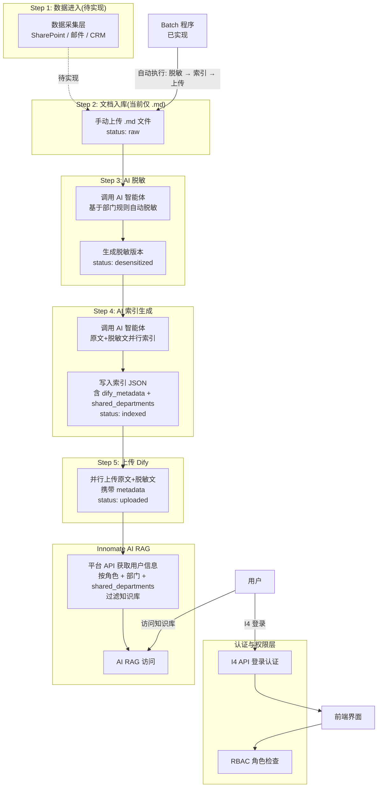
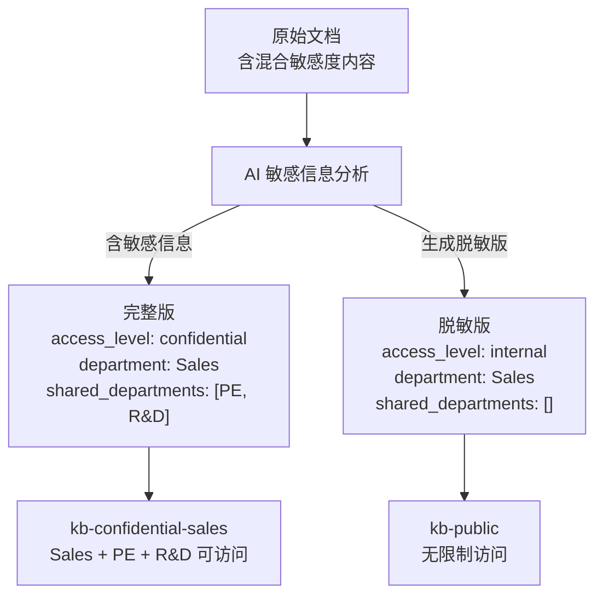
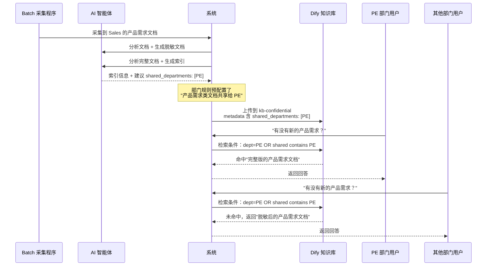
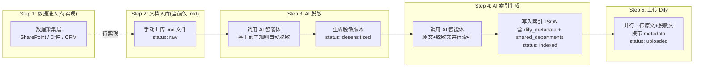

# 数据平台项目汇报材料

**汇报对象**：公司领导  
**汇报人**：Yun XING / 邢运  
**日期**：2026 年 4 月 14 日  
**项目状态**：开发中 — 核心功能已完成，数据采集中

---

## 一、项目概述

### 1.1 项目愿景

构建一个**可持续、可扩展、安全**的企业级数据平台，实现从 SharePoint 数据采集到 AI RAG 访问的端到端自动化流程，为 Innomate AI 平台提供高质量数据源。

### 1.2 核心业务价值

| 价值维度 | 具体收益 |
|---------|---------|
| **效率提升** | 自动化采集替代人工整理，预计节省 80% 数据准备时间 |
| **知识沉淀** | 建立企业级知识库，避免信息孤岛 |
| **AI 赋能** | 为 AI RAG 提供结构化、高质量数据，提升问答准确性 |
| **安全可控** | 完整的权限体系和审计日志，确保数据合规使用 |
| **可持续性** | 模块化设计，未来可接入其他数据源 |

---

## 1.3 项目全景图 📊

> **适合生成的图表**：系统架构流程图（建议使用 Mermaid 或 Visio 绘制）
>
> 1. 废除用户上传
>
> 2. 自动采集的方式（待实现）：SharePoint、邮件、CRM 系统 OPP 数据
>
> 3. 上传规则确认  
>
> 4. 权限管理方案（修正）：
>    - ~~废弃方案：对数据增加内容级权限标签（`【internal】...【/internal】`）~~
>    - **原因**：Dify RAG 分块(chunking)会切断标签，Dify 不识别自定义标签，无法在检索阶段执行过滤
>    - **采用方案**：文档级 metadata 权限 + AI 自动脱敏生成双版本
>      - 完整版 → 进入 kb-confidential（仅授权人员可访问）
>      - 脱敏版 → 进入 kb-internal/kb-public（更大范围可访问）
>    - **跨部门共享**：metadata 新增 `shared_departments` 字段，支持 Owner 指定其他部门查看
>    - **规则引擎实现方式**：脱敏规则和索引规则直接作为 AI prompt 上下文传入，由 AI 理解后自动执行，无需独立验证步骤



**图表说明**：
- **Step 1-2（数据采集/入库）**：待实现。当前通过手动上传 .md 文件进入系统
- **Step 3（AI 脱敏）**：✅ 已实现。基于部门规则自动脱敏，生成脱敏版本
- **Step 4（AI 索引生成）**：✅ 已实现。同时读取原文和脱敏文，并行调用 AI 生成索引 JSON，包含 dify_metadata 和共享部门信息
- **Step 5（上传 Dify）**：✅ 已实现。并行上传原文和脱敏文到知识库，携带 metadata
- **规则引擎**：不作为独立验证步骤存在，而是直接作为 AI prompt 上下文传入，由 AI 理解后自动执行
- **AI 账号采集策略（待实现）**：两种模式并行


  | 模式               | 原理                                                         | 适用场景         |
  | ------------------ | ------------------------------------------------------------ | ---------------- |
  | **约定文档库监控** | 每个部门在 SharePoint 建立 "AI-Knowledge-Inbox" 文档库，用户将文档放入此库，AI 账号监控 | 主动推送，最可控 |
  | **列表增量采集**   | AI 账号有权限的列表，按 `Modified >= last_sync_time` 增量拉取 | 公告等公开列表   |

---

## 二、核心功能模块

### 2.1 功能模块总览 📊

> **适合生成的图表**：模块功能矩阵图（建议使用表格或矩阵图）

| 模块名称 | 核心功能 | 状态 |
|---------|---------|------|
| **登录认证** | I4 API 认证、用户管理、JWT 会话控制 | ✅ 已实现 |
| **权限体系** | RBAC 角色模型、文档级 metadata 权限、AI 脱敏双版本、跨部门共享 | ✅ 已实现 |
| **文档管理** | .md 文件上传、查看(原始/脱敏对比)、删除、批量操作 | ✅ 已实现 |
| **AI 脱敏** | 基于部门规则的 AI 自动脱敏(Qwen3.5-plus)、移除/替换/概括三种策略 | ✅ 已实现 |
| **AI 索引生成** | 自动提取用途/关键词/场景/人群/分类/共享部门/access_level | ✅ 已实现 |
| **AI 规则引擎** | 自然语言规则配置、公共规则+部门规则两级验证、优先级排序 | ✅ 已实现 |
| **Dify 上传** | 带 metadata 上传、多知识库支持、上传状态轮询 | ✅ 已实现 |
| **Batch 自动化** | 并发处理、状态跟踪、日志查看、历史记录 | ✅ 已实现 |
| **前端门户** | React + Ant Design、文档管理、规则配置、Batch 监控、系统设置 | ✅ 已实现 |
| **审计日志** | 全操作记录中间件 | ✅ 已实现 |
| **提示词管理** | 在线编辑脱敏/索引系统提示词 | ✅ 已实现 |
| **系统设置** | 知识库 CRUD、数据目录配置 | ✅ 已实现 |
| **数据采集** | SharePoint / 邮件 / CRM 自动采集 | 🔄 待实现 |
| **文档转换** | 多格式转 Markdown (PDF/Word/Excel/MSG) | 🔄 待实现 |

---

### 2.2 权限体系设计 📊

> **适合生成的图表**：权限矩阵热力图（建议使用 Excel 或 BI 工具绘制）

#### 角色层级设计


#### 权限设计核心原则

> **一篇文档 = 一个权限级别，权限只在 metadata 层面控制，通过 Dify 知识库隔离实现访问控制。**
>
> ~~废弃方案：内容级标签（`【internal】...【/internal】`）——Dify RAG 分块会切断标签，无法执行~~

#### 文档权限 Metadata 结构

```yaml
---
type: knowledge_document
filename: "Q1销售报告.md"
domain: "wellness"
access_level: internal              # 文档整体权限级别
department: "Sales"                 # 发文部门
shared_departments:                 # 【新增】跨部门共享
  - "PE"
  - "R&D"
section: "CH71"
creator: "张销售"
created: 2026-03-25
is_redacted: false                  # 【新增】是否为脱敏版
original_doc_id: null               # 【新增】脱敏版关联的原始文档 ID
---
```

#### 文档访问权限矩阵

> **适合生成的图表**：权限矩阵表格（条件格式热力图）

| access_level | admin | dept_admin(本部门) | dept_admin(其他部门) | 部门成员(本部门) | 部门成员(shared) | 部门成员(其他) | viewer |
| ------------ | ----- | ----------------- | ------------------- | -------------- | -------------- | ------------ | ------ |
| **public(脱敏)** | ✅ 可见 | ✅ 可见            | ✅ 可见              | ✅ 可见         | ✅ 可见         | ✅ 可见       | ✅ 可见 |
| **confidential** | ✅ 可见 | ✅ 可见            | ❌ 不可见            | ✅ 可见         | ✅ 可见   | ❌ 不可见     | ❌ 不可见 |

> **shared 列说明**：当文档 metadata 的 `shared_departments` 包含该用户所属部门时，该用户视为"shared 部门成员"。
> 例如：Sales 发布的 internal 文档共享给 PE，则 PE 成员可以查看该文档。

#### ***问题是： 完整的文档谁可以看？  部门内部所有人默认可以看？还是需要根据部门规则 来指定shared 人员？***


#### 混合敏感度文档处理：AI 脱敏双版本方案

当一篇文档中**部分内容敏感、其余内容可公开**时，不使用内容标签，而是 **AI 自动生成脱敏版**：



**三种脱敏策略**（AI 根据内容类型自动选择）：

| 策略 | 做法 | 适用场景 | 示例 |
|------|------|---------|------|
| **移除** | 整段删除敏感内容 | 段落独立，删除不影响理解 | 删除"人员变动"整个章节 |
| **替换** | 用占位符替换具体数据 | 保留上下文，隐藏数字 | "定价：[机密数据]" |
| **概括** | AI 改写为模糊描述 | 需保留语义但隐去细节 | "产品分为两个档次，另有大客户优惠" |

**脱敏效果示例**：

原始版（confidential）：
```
## 价格体系
- 基础版定价：9999 元
- 旗舰版定价：19999 元
- 大客户折扣：最低 7 折
```

脱敏版（internal）：
```
## 价格体系
产品分为基础版和旗舰版两个档次，另有大客户优惠政策。
（详细定价信息为机密，请联系销售部获取权限）
```

#### 跨部门共享机制

**场景**：Sales 发布的产品需求文档，希望 PE 技术部门产看完整文档来提供方案。希望其他部门只能查看脱敏后的文档。

**实现方式**：




**shared_departments 的设置方式**：

1. **部门规则预配置**：dept_admin 预设"哪类文档默认共享给哪些部门"
2. **AI 智能建议**：AI 根据文档内容推断可能需要共享的部门
3. **人工审核调整**：dept_admin 在审核队列中可手动调整共享范围

---

### 2.3 核心业务流水线 📊

> **适合生成的图表**：5 步流程图（建议使用泳道图或流程图）



**流程说明**：
1. **Step 1**：🔄 数据进入（待实现：SharePoint 自动采集 / 邮件转发 / CRM 数据采集，**已废除用户手动上传**）
2. **Step 2**：🔄 当前仅支持 .md 文件手动上传，多格式转换待实现
3. **Step 3**：✅ **AI 脱敏**：基于部门规则调用 AI 智能体自动脱敏，生成脱敏版本（移除/替换/概括三种策略）
4. **Step 4**：✅ **AI 索引生成**：同时读取原文和脱敏文，并行调用 AI 生成索引 JSON，包含用途/关键词/场景/人群/分类/摘要/共享部门/权限级别，以及 Dify-ready metadata
5. **Step 5**：✅ **上传 Dify**：并行上传原文和脱敏文到知识库，携带 metadata（含 shared_departments 用于权限过滤和 RAG 检索优化）

> **规则引擎说明**：脱敏规则和索引规则不作为独立验证步骤存在。它们通过 `_build_rules_context()` 和 `_build_index_rules_context()` 函数直接作为 AI prompt 上下文传入，由 AI 理解后自动执行。这消除了原计划中"规则验证 → 待审核队列 → 管理员审核"的中间环节，使流程更加高效。

---

### 2.4 AI 驱动的规则引擎 📊

> **适合生成的图表**：规则配置界面原型图（建议使用 Figma 或手绘原型）

#### 文件上传主体规则

```
法务提供的公司policy文档
  → 通过Dify智能体进行上传数据验证
```

#### 部门规则生命周期

```
用户创建规则（自然语言描述）
  → 调用 Dify "Rule Refiner" 智能体润色为标准化提示词
  → 用户确认/微调润色结果
  → 存储为 rule_prompt（规则的最终形态）
  → 后续每次文档进入 Step 4 时，AI 根据 rule_prompt 验证合规性
```

#### 部门规则配置界面原型


.png)

**创新点**：

- 用户用**自然语言**描述规则，无需学习复杂配置
- AI 自动润色为**标准化提示词**，消除歧义
- AI 根据提示词**语义理解**文档合规性，非死板匹配关键词

---

## 三、技术架构

### 3.1 技术栈总览 📊

> **适合生成的图表**：技术栈分层图（建议使用分层架构图）

| 层级 | 技术选型 | 状态 |
|------|---------|------|
| **后端框架** | FastAPI | ✅ 已实现 |
| **认证授权** | I4 API 验证 + JWT | ✅ 已实现 |
| **权限模型** | 自定义 RBAC + Dify KB 隔离 | ✅ 已实现 |
| **数据库** | SQLite (开发中) → PostgreSQL (生产) | ✅ 已实现基础 |
| **ORM** | SQLAlchemy + 轻量级迁移 | ✅ 已实现 |
| **前端框架** | React + TypeScript + Vite | ✅ 已实现 |
| **UI 组件库** | Ant Design | ✅ 已实现 |
| **AI 引擎** | DashScope (Qwen3.5-plus) | ✅ 已实现 |
| **知识库** | Dify Knowledge Base API | ✅ 已实现 |
| **文档转换** | 当前仅支持 .md，多格式待实现 | 🔄 待实现 |
| **Batch 调度** | 系统级 Batch 服务 + 并发控制 | ✅ 已实现 |
| **审计日志** | 自定义中间件 | ✅ 已实现 |
| **容器化** | Docker + docker-compose (Nginx 前端 + PostgreSQL) | ✅ 已实现配置 |

---

### 3.2 项目目录结构 📊

> **适合生成的图表**：树状目录图（建议使用树形图或思维导图）

```
AI_Data_Platform/
├── docker-compose.yml                    # Docker 编排(PostgreSQL + Backend + Frontend)
├── docker-compose.prod.yml               # 生产环境配置
│
├── backend/                              # 后端服务
│   ├── requirements.txt                  # Python 依赖
│   ├── Dockerfile                        # 后端镜像
│   ├── .env.example                      # 环境变量模板
│   │
│   ├── prompts/                          # 系统提示词文件
│   │   ├── desensitize.txt               # AI 脱敏提示词
│   │   └── index_generate.txt            # AI 索引生成提示词
│   │
│   └── app/
│       ├── main.py                       # FastAPI 主应用入口
│       ├── config.py                     # 配置管理(Pydantic Settings)
│       ├── database.py                   # SQLAlchemy 引擎 + 轻量级迁移
│       │
│       ├── api/                          # API 层
│       │   ├── deps.py                   # JWT 认证依赖
│       │   ├── middleware.py             # 审计日志中间件
│       │   └── routes/
│       │       ├── auth.py               # 登录认证(I4 API + JWT)
│       │       ├── documents.py          # 文档 CRUD + 脱敏/索引/上传
│       │       ├── rules.py              # 脱敏规则 CRUD
│       │       ├── index_rules.py        # 索引规则 CRUD
│       │       ├── batch.py              # Batch 任务控制
│       │       ├── prompts.py            # 提示词管理
│       │       └── settings.py           # 系统设置 + 知识库管理
│       │
│       ├── core/                         # 核心业务逻辑
│       │   ├── ai_service.py             # DashScope/OpenAI AI 客户端(分块/重试)
│       │   ├── desensitizer.py           # AI 驱动的文档脱敏
│       │   ├── index_generator.py        # AI 驱动的索引生成
│       │   ├── dify_uploader.py          # Dify KB 上传 + metadata 管道
│       │   └── file_manager.py           # 原始/脱敏/索引文件 I/O
│       │
│       ├── models/                       # 数据模型
│       │   ├── user.py                   # 用户模型
│       │   ├── document.py               # 文档元数据模型
│       │   ├── rule.py                   # 脱敏规则模型
│       │   ├── index_rule.py             # 索引规则模型
│       │   ├── batch_log.py              # Batch 日志模型(批量+文件)
│       │   └── setting.py                # 系统设置模型
│       │
│       └── services/                     # 业务服务层
│           ├── auth_service.py           # I4 API 集成 + JWT 创建
│           ├── batch_service.py          # Batch 全流程编排(并发+分步)
│           ├── settings_service.py       # 数据库配置 + 知识库 CRUD
│           └── dify_client.py            # 预留(当前使用 dify_uploader.py)
│
├── frontend/                             # 前端应用
│   ├── package.json
│   ├── Dockerfile                        # 前端镜像(Nginx 服务)
│   ├── nginx.conf
│   │
│   └── src/
│       ├── main.tsx                      # React 入口
│       ├── App.tsx                       # 路由 + 布局 + 鉴权守卫
│       │
│       ├── api/
│       │   ├── client.ts                 # Axios 实例 + 自动刷新
│       │   ├── index.ts                  # API 方法封装
│       │   └── types.ts                  # TypeScript 类型定义
│       │
│       └── pages/
│           ├── LoginPage.tsx             # 登录页(I4 API 验证)
│           ├── DocumentListPage.tsx      # 文档管理(上传/查看/脱敏/索引/上传/删除)
│           ├── RuleManagePage.tsx        # 规则管理(脱敏规则+索引规则+提示词编辑)
│           ├── BatchMonitorPage.tsx      # Batch 监控(执行+历史+日志)
│           └── SettingsPage.tsx          # 系统设置(知识库管理+数据目录配置)
│
├── sharepoint_client.py                  # SharePoint 采集脚本(独立脚本,待集成)
└── sharepoint_api.py                     # SharePoint API 脚本(独立脚本,待集成)
```

---

## 四、实施计划

### 4.1 阶段 A — 已完成（核心功能）

1. **认证系统**：I4 API 集成 + JWT 会话管理
2. **文档管理**：.md 文件上传、原始/脱敏对比查看、删除、批量操作
3. **AI 脱敏**：基于部门规则的 AI 自动脱敏（Qwen3.5-plus），支持移除/替换/概括三种策略
4. **AI 索引**：智能标注生成（用途、关键词、场景、人群、分类、摘要、共享部门、权限级别）
5. **Dify 集成**：多知识库上传 + metadata 设置 + 上传状态轮询
6. **规则管理**：脱敏规则 CRUD（部门级、类型化、优先级排序）+ 索引规则 CRUD（共享/访问/分类）
7. **Batch 系统**：并发处理（信号量控制）+ 状态监控 + 历史记录 + 详细日志
8. **前端门户**：React + Ant Design，5 个页面（登录、文档管理、规则管理、Batch 监控、系统设置）
9. **系统设置**：知识库管理（CRUD + 默认设置）+ 数据目录配置
10. **提示词管理**：在线编辑脱敏/索引系统提示词（.txt 文件）
11. **审计日志**：全操作记录中间件
12. **Docker 配置**：PostgreSQL + Backend + Frontend(Nginx) 三容器编排

### 4.2 阶段 B — 待实现（数据采集层）

1. **SharePoint 自动采集**：增量同步 + 附件合并 + 权限按人抽取
2. **邮件采集**：AI 邮箱转发自动入库 + MSG 解析
3. **CRM 数据采集**：OPP 数据自动拉取 + 增量同步
4. **多格式转换**：PDF/Word/Excel/MSG 转 Markdown（MarkItDown API 或替代方案）
5. **生产部署**：SQLite 迁移到 PostgreSQL + Docker Compose 部署

---

## 六、风险与对策

### 6.1 风险评估 📊

> **适合生成的图表**：风险矩阵图（概率 - 影响矩阵，建议使用 Excel 散点图）

| 风险项 | 概率 | 影响 | 风险等级 | 应对措施 |
|-------|------|------|---------|---------|
| SharePoint 不可用/部门文档库不让建立 | 中 | 高 | 🔴 高 | 寻求老板支持，提供备选方案 |
| AI 规则判断不准确 | 中 | 中 | 🟡 中 | 转人工审核，部门设定自动/手动判断阈值 |
| 数据采集 API 不稳定 | 中 | 高 | 🔴 高 | 增量同步、重试机制、异常日志、断点续传 |
| 多格式转换解析错误 | 高 | 中 | 🟡 中 | 异常处理、错误日志、手动重试机制 |
| Dify API 不稳定 | 低 | 高 | 🟡 中 | 自动重传机制、上传状态轮询 |
| 业务需求变更 | 高 | 中 | 🟡 中 | 分阶段迭代，已实现核心功能可作为基础快速调整 |

---

## 七、资源需求

### 7.1 人力资源

| 角色 | 投入比例 | 主要职责 |
|------|---------|---------|
| **项目负责人**（邢运） | 100% | 全栈开发、项目管理、跨部门沟通 |
| **老板**（Means） | 5% | 方向把控、资源协调、关键决策 |
| **SharePoint 管理员** | 2% | 权限审批、技术支持 |
| **法务** | 2% | 安全方案审查、合规指导 |
| **BE内部门担当** | 5% | 需求确认、UAT 测试 |

### 8.1 关键决策点

1. **项目立项确认** ✅
   - 确认项目优先级
   - 确认资源投入

2. **跨部门协调** 🤝
   - 协助与 SharePoint MMC沟通
   - 协助与法务沟通
   - 协调业务部门参与知识库流程确认

3. **阶段性评审** 📅
   - 阶段 3 完成后：Demo 演示（确认方向）
   - 阶段 6 完成后：端到端测试（确认功能）
   - 阶段 9 完成后：上线评审（确认上线）

### 8.2 汇报频率

| 汇报类型 | 频率 | 形式 | 内容 |
|---------|------|------|------|
| **周报** | 每周 | 邮件/文档 | 本周进展、下周计划、风险问题 |
| **阶段性汇报** | 每 2 周 | 会议 + Demo | 阶段成果演示、问题讨论、下一步确认 |
| **里程碑汇报** | 关键节点 | 正式会议 | 里程碑验收、资源调整、方向确认 |

---

## 九、总结

### 9.1 项目优点

1. **AI 驱动**：索引生成、规则引擎、敏感信息识别均由 AI 智能体完成，非硬编码逻辑
2. **自然语言配置**：业务人员可用自然语言描述规则，AI 自动润色为标准化提示词
3. **安全可控**：文档级 metadata 权限 + Dify 知识库隔离 + AI 脱敏双版本，满足企业安全要求
4. **精准共享**：跨部门共享机制（shared_departments）解决了业务协作场景下的文档可见性问题
5. **与 Dify 架构兼容**：权限控制通过知识库隔离和 metadata 过滤实现，不依赖 Dify 定制开发
6. **核心功能已落地**：认证、文档管理、AI 脱敏、索引生成、规则引擎、Dify 上传、Batch 系统、前端门户均已实现并可运行

### 9.2 项目难点（数据采集相关）

1. **SharePoint API 权限**（PIC Xing）：AI 账号访问权限申请、部门文档库建立可行性验证
2. **多格式转换**：PDF/Word/Excel/MSG 等格式的准确解析和 Markdown 转换质量
3. **邮件自动采集**：AI 邮箱配置、MSG 解析、附件提取
4. **CRM 数据对接**：OPP 数据格式适配、增量同步策略
5. **生产部署**：SQLite 迁移到 PostgreSQL、Docker Compose 部署稳定性

### 9.3 已完成功能清单

| 模块 | 状态 |
|------|------|
| I4 API 认证 + JWT | ✅ |
| 文档上传/查看/删除 | ✅ |
| AI 脱敏（三种策略） | ✅ |
| AI 索引生成（六项标注） | ✅ |
| 脱敏规则 CRUD | ✅ |
| 索引规则 CRUD | ✅ |
| Dify 多知识库上传 | ✅ |
| Batch 并发处理 + 监控 | ✅ |
| 提示词在线编辑 | ✅ |
| 知识库管理 | ✅ |
| 系统设置 | ✅ |
| 审计日志 | ✅ |
| Docker 配置 | ✅ |

### 9.4 下一步行动

**阶段 B 开发计划**：

- [ ] SharePoint API 权限申请 + 增量采集开发
- [ ] 邮件自动采集模块开发
- [ ] CRM OPP 数据对接
- [ ] 多格式转 Markdown（MarkItDown API 或替代方案）
- [ ] 生产部署测试（PostgreSQL + Docker Compose）

**外部协调事项**：

- [ ] 向 SharePoint 管理员申请 AI 账号访问权限
- [ ] 找法务确认文档知识库管理方案
- [ ] 与各部门确认共享规则

---

